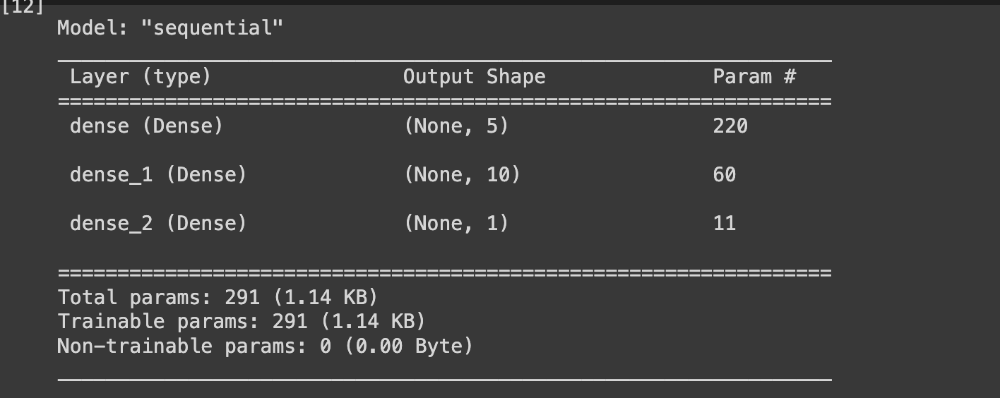
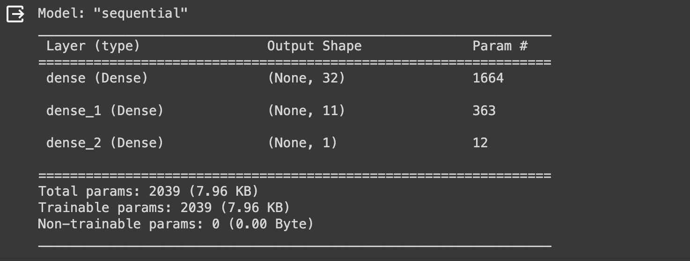
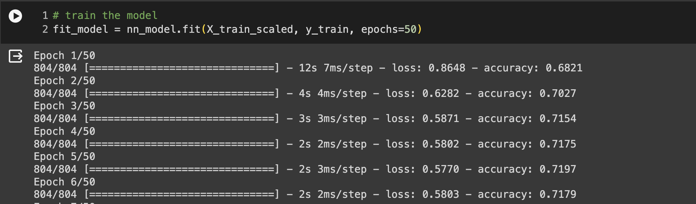
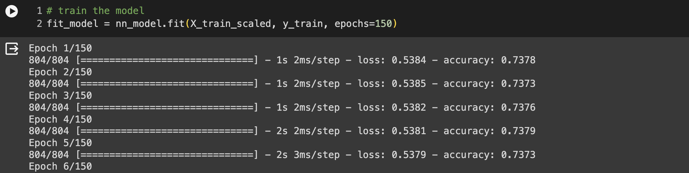

# deep-learning-challenge

## Background

This project explores fictional data on venture success of organizations that have applied for funding to an investment company called Alphabet Soup. Our goal was to develop a model that predicts whether applicants will be successful in their ventures if funded by Alphabet Soup.

We were provided with a CSV file containing more than 34,000 organizations that have received funding from Alphabet Soup over the years. The dataset contained the following information:

* EIN and NAME—-identification columns
* APPLICATION_TYPE—-funding application type
* AFFILIATION—-affiliated sector of industry
* CLASSIFICATION—-government organization classification
* USE_CASE—-use case for funding
* ORGANIZATION—-organization type
* STATUS—-active status
* INCOME_AMT--income classification
* SPECIAL_CONSIDERATIONS--special considerations for application
* ASK_AMT—-funding amount requested
* IS_SUCCESSFUL--whether the money used effectively

## Methods

There were three main steps to accomplish our mission:
1. Preprocess the data
2. Compile, train and evaluate the model
3. Optimize the model

We programmed in Python and wrote our code in two different Colab Notebooks to first develop a neural network model (`AlphabetSoupCharity_Starter_Code.ipynb`) and then to try optimizing it to a target predictive accuracy higher than 75% (`AlphabetSoupCharity_Optimization.ipynb`).

In the preprocessing data step, the `StandardScaler()` function from the `scikit-learn` library was used to standardize features (X). After scaling the data, encoding categorical variables using `pd.get_dummies()`, and splitting the data into training and testing datasets, a neural network model was created, compiled, trained and evaluated. The models were saved as HDF5 files at the end.

## Results

Our first neural network model was consisted of 3 layers and ReLU (Rectified Linear Unit) as the activation function for all the layers.


For the optimization model, we increased the number of nodes and used sigmoid in addition to ReLU. 


We were not able to achive over 75% predictive accuracy as we aimed and hoped for. Despite of many trials, we achived up to only 73% accuracy.


**first model**



**optimized model**


We addressed the following questions to explore and interpret our results:

### Data Preprocessing
```
* What variable(s) are the target(s) for your model?
The target variable (y) was IS_SUCCESSFUL indicating whether the money funded by Alphabet Soup was worthwhile.

* What variable(s) are the features for your model?
All except the target (IS_SUCCESSFUL) and identification variables (EIN and NAME) were added as features (X) for our model.

* What variable(s) should be removed from the input data because they are neither targets nor features?
The identification variables including EIN and NAME were dropped because they did not carry intrinsic value to our analysis (the organization's name and ID number would not necessarily determine success in its venture).
```

### Compiling, Training, and Evaluating the Model
```
* How many neurons, layers, and activation functions did you select for your neural network model, and why?

After experimenting with the model, we have come up with a final neural network model consisted of 3 layers, first two of which contain 32 and 11 nodes respectively, and ReLU and sigmoid activation functions. The model improved when sigmoid function was introduced instead of using ReLU for all the layers.

* Were you able to achieve the target model performance?
No, we were not able to achieve the target model performance over 75% accuracy.

* What steps did you take in your attempts to increase model performance?
Our attempts to optimize our model included: lowering the cutoff values for the APPLICATION_TYPE and CLASSIFICATION columns to reduce the number of bins, adding more hidden layers, increasing the number of hidden nodes, selecting different activation functions for the layers, and experimenting with the number of epochs to the training regimen.
```

## Conclusion and Future Directions
In conclusion, our neural network model did not perform as well as we had hoped. In the future, we would be interested in fitting a logistic regression on these data because it's simple and computationally efficient, especially for binary classification tasks (e.g. successful or not successful). Also, when we used sigmoid function, our neural network model improved, albeit slightly. In logistic regression, the sigmoid function is used to model the relationship between the input features and the probability of the target variable. Therefore, predicting the venture success of the funded organizations by fitting a logistic regression on the data would be our next step.